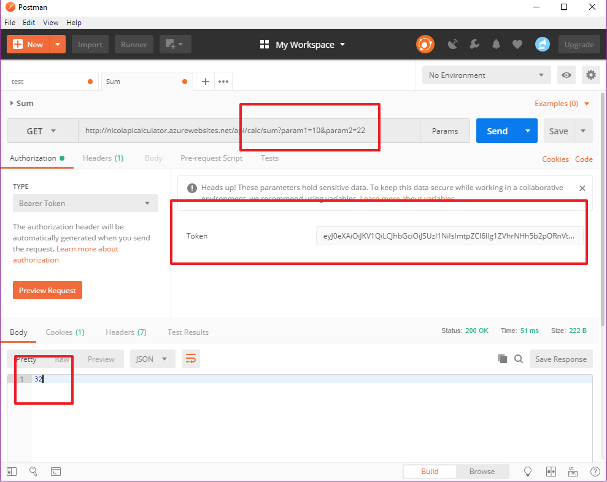

# Setup NicolAPICalculator

In this walktrough we will configure a dot net core api including the configuration for Azure B2C tenant.

Objective of this API is to expose 3 "complex" operations (^2, %, !) as authenticathed API. In order to be implemented, these APIs require calls to [Calculator Api](setup-apicalculator.md). We are also assuming in this sample that impersonation is required in API 2 API call.

The configuration is very similar to ApiCalculator, so I will *highlight* all relevant diffenences.

# (1) Azure B2C Configuration
creat an application on Azure B2C.

* Name: ApiScientificCalculator
* WebApp/Include WebAPI: YES
* WebApp/allow Implicit Flow: YES
* Reply URL: https://jwt.ms 
  
# (2) Create a ASP Net Core API not authenticated
Via Visual Studio create a solution of type "ASP.NET Core Web Application", type API, with NO Authentication

# (3) Create a policy: B2C\_1\_signin-default
*You don't need to create an additional policy, just use the policy already created.*

# (4) Configure appsettings.json and solution for authentication

In appsettings.config add the following information:

	"AzureAdB2C": {
	"Tenant": "nicolb2c.onmicrosoft.com",
	"ClientId": "<the application id (guid)>",
	"Policy": "B2C_1_signin-default"
	},

also add following nuget packages to the solution

	Microsoft.AspNetCore.Authentication.JwtBearer
	Microsoft.AspNetCore.Mvc
	Microsoft.Extensions.Configuration.UserSecrets
	Microsoft.Extensions.SecretManager.Tools

# (5) Update the code 

Update [program.cs](nicold.playground/nicold.APICalculator/program.cs) and [startup.cs](nicold.playground/nicold.APICalculator/startup.cs) as shown in this repository. 

Then create a controller for the home page [Controllers/HomeController.cs](nicold.playground/nicold.APICalculator/Controllers/HomeController.cs) with the corresponding view [View/Home/index.shtml](nicold.playground/nicold.APICalculator/View/Home/index.shtml)

It is noe the time to build the real API. We will implement the API with the controller **Controllers/CalcController.cs**

The anonymous API looks like the following:

	public class CalcController : Controller
	{
		// GET api/values/
		[HttpGet("{op}")]
		public IActionResult Get(string op, [FromQuery] double param1, [FromQuery] double param2)
		{
		double result = 0;
		// omiss...

		result = param1 + param2;
		return new ObjectResult(result);
		}
	}

if we want to enable the authentication, we need to add the **\[Authorize\]** attribute to the class, and everything is ready. In this sample we just require authentication, but if you need also to verify the presence of a specific claim or somthing, you can filter within the get() method on attribute in **HttpContext.User** and/or **HttpContext.User.Claims**.

# retrieve the bearer and call the API
That's all. In order to call the API, you can call the following link [https://login.microsoftonline.com/nicolb2c.onmicrosoft.com/oauth2/v2.0/authorize?p=B2C_1_signin-default&client_id=27339a64-0c55-4ba0-8632-aaaa81030814&nonce=defaultNonce&redirect_uri=https%3A%2F%2Fjwt.ms&scope=https%3A%2F%2Fnicolb2c.onmicrosoft.com%2FApiCalculator%2Fuser_impersonation&response_type=token&prompt=login](https://login.microsoftonline.com/nicolb2c.onmicrosoft.com/oauth2/v2.0/authorize?p=B2C_1_signin-default&client_id=27339a64-0c55-4ba0-8632-aaaa81030814&nonce=defaultNonce&redirect_uri=https%3A%2F%2Fjwt.ms&scope=https%3A%2F%2Fnicolb2c.onmicrosoft.com%2FApiCalculator%2Fuser_impersonation&response_type=token&prompt=login) it gives you the bearer you can put in the header to call the api.

