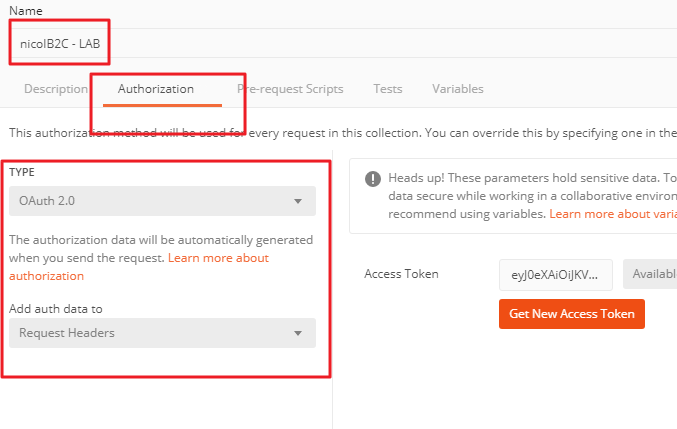

# Setup Postman to call Azure B2C API	
Postman has a nice feature that helps you retrieve easily a bearer token needed to access to an OAuth 2.0 endpoint. You can find this nice tool in Edit Collection > Authorization form.

In this page I will describe how to configure both Azure B2C Tenant and Postman to use this feature.

# Setup Azure B2C Tenant
From the Azure B2C perspective, Postman is just another application, so like all the other applications needs to be registered on the tenant.

Once registered, in order to allows it to access other playground APIs, you need to explicitly allows the API Access for postman app to other APIs. 

On Azure B2C tenant creates a new application with these informations:

* Name: PostmanClient
* Include Web App/Web API Access: YES
* Allow Implicit Flow: YES (Postman acts as a SPA WebApplication client)
* Reply URL: https://getpostman.com/postman
* App DI URI: postman

API Access blade allows you to configure all the APIs "PostmanClient" is authorized to access. First of all Add "PostmanClient" (himself) to this list, and then all the APIs you want to call from here. In the image below, PostmanClient is permitted to 3 scopes:

* User's Profile (needed to access to id token and refresh token endpoints)
* PostmanClient
* ApiCalculator (this Postman bearer can be used also to call ApiCalculator)

# Setup Postman
In Postman, create a Collection, then go to Edit Collection > Authorization:
Use the following parameters:

Parameter | Value
-|-
Type| OAuth 2.0
Add auth dato to| Request Header

Click on Get New Access Token, and use the following parameters:

Parameter | Value
-|-
Token Name | anything-you-prefer
Grant Type | Implicit
Callback URL|https://getpostman.com/postman
Auth URL|https://login.microsoftonline.com/**your tenant name**/oauth2/v2.0/authorize?p=**your_policy_name**
Client ID| **your postman Azure B2C Application id**
Client Secret| 
Scope| https://**your b2c tenant name**.onmicrosoft.com/**your postman app name**/**your scope name**

